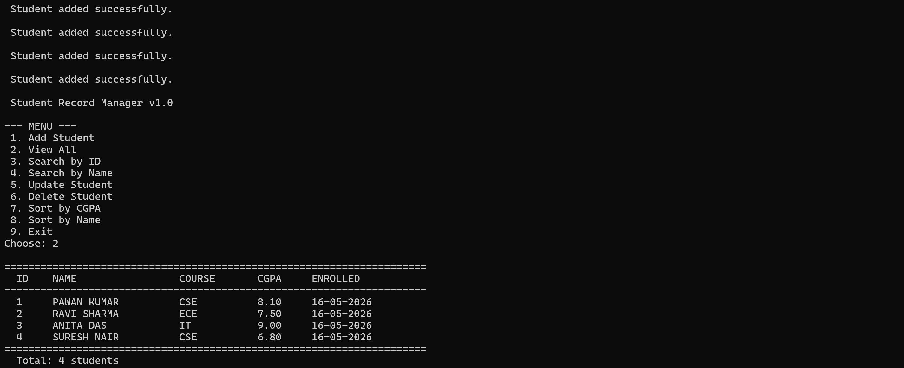
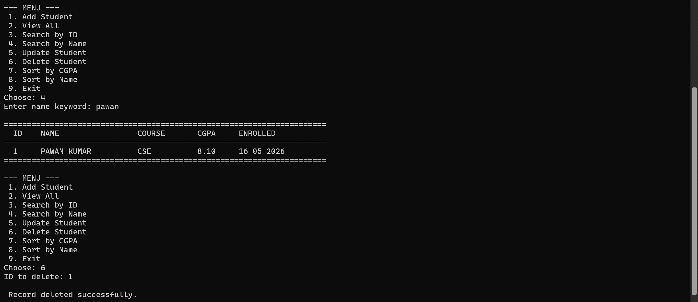
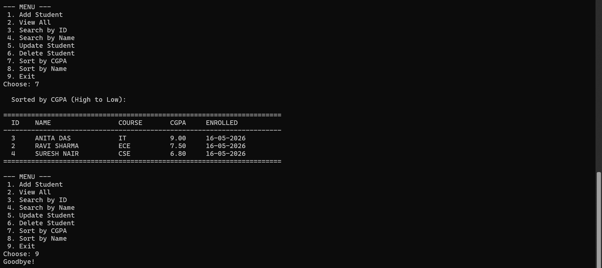

# Student Record Manager — C# Console App

A beginner-level C# console application that demonstrates core language concepts through a simple **Student CRUD system** with an in-memory data store.

> Built as part of my C# learning journey. The focus is on understanding language fundamentals — not on databases or frameworks.

---

## Features

| Feature | Description |
|---|---|
| Add student | Enter name, course, and CGPA |
| View all | Formatted tabular output |
| Search by ID | Array-based linear search |
| Search by name | Case-insensitive keyword match |
| Update record | Edit name, course, or CGPA |
| Delete record | Remove by ID |
| Sort by CGPA | High to low using LINQ |
| Sort by name | A to Z using LINQ |

---

## C# Concepts Practised

This project was intentionally written to cover multiple beginner-to-intermediate concepts:

### 1. OOP (Object-Oriented Programming)
- **Class & constructor** — `Student` class with a parameterised constructor
- **Encapsulation** — Auto-properties (`{ get; set; }`)
- **Abstraction** — `BaseRepository<T>` abstract class with abstract methods
- **Inheritance** — `StudentRepository` extends `BaseRepository<Student>`
- **Polymorphism** — `IPrintable` interface implemented by `ReportPrinter`

### 2. Exception Handling
- `try / catch` blocks in every user-input method
- Multiple `catch` types: `FormatException`, `ArgumentException`, `ArgumentOutOfRangeException`

### 3. Control Flow
- `for` — iterating seed data array
- `foreach` — printing and searching
- `while` — keeping the menu running
- `switch` — dispatching menu choices
- `if / else` — input validation

### 4. String Handling
- `Trim()`, `ToUpper()`, `Contains()`
- `string.IsNullOrWhiteSpace()`
- String interpolation `$"..."` and format specifiers (`:F2`, `,-20`)

### 5. Collections
- `List<T>` — primary in-memory store
- Arrays — seed data; `ToArray()` for search demo
- `ToList()`, `Count`

### 6. Date & Time
- `DateTime.Now` — set on enrolment
- Custom format string `dd-MM-yyyy`

### 7. Sorting (LINQ)
- `OrderByDescending(s => s.CGPA)`
- `OrderBy(s => s.Name)`

### 8. Searching
- `List.Find` / `FindAll`
- Manual `foreach` over an array

### 9. Generics
- `BaseRepository<T>` — generic abstract repository pattern

---

## Project Structure

```
StudentRecordManager/
├── StudentRecordManager.sln
├── .gitignore
├── README.md
└── StudentRecordManager/
    ├── StudentRecordManager.csproj
    └── Program.cs
```

---

## How to Run

**Requirements:** [.NET 8 SDK](https://dotnet.microsoft.com/download)

```bash
# Clone the repo
git clone https://github.com/<your-username>/StudentRecordManager.git
cd StudentRecordManager

# Run
dotnet run --project StudentRecordManager
```

Or open `StudentRecordManager.sln` in Visual Studio / Rider and press **F5**.

---

## Sample Output

```
Student Record Manager v1.0

--- MENU ---
 1. Add Student
 2. View All
 ...

======================================================================
  ID    NAME                 COURSE       CGPA     ENROLLED
----------------------------------------------------------------------
  1     PAWAN KUMAR          CSE          8.10     15-05-2025
  2     RAVI SHARMA          ECE          7.50     15-05-2025
  3     ANITA DAS            IT           9.00     15-05-2025
  4     SURESH NAIR          CSE          6.80     15-05-2025
======================================================================
```

---

## Screenshots

### Menu and View List


### Search and Delete


### Sort and Exit



## What I Learned

- How to structure a C# console project using OOP principles
- Why abstract classes and interfaces are useful even in small projects
- How LINQ simplifies sorting and filtering collections
- How to handle invalid user input gracefully with exception handling

---

## Author

**B PAAWAN KUMAR** — learning C# | [LinkedIn](www.linkedin.com/in/bairi-paawan-kumar-26bb4628b) | [GitHub](https://github.com/PAWAN0836)]

---

## License

MIT — free to use, fork, and learn from.

## Screenshots

### Menu and View List


### Search and Delete


### Sort and Exit

